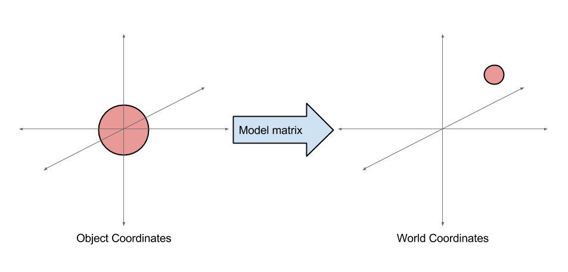
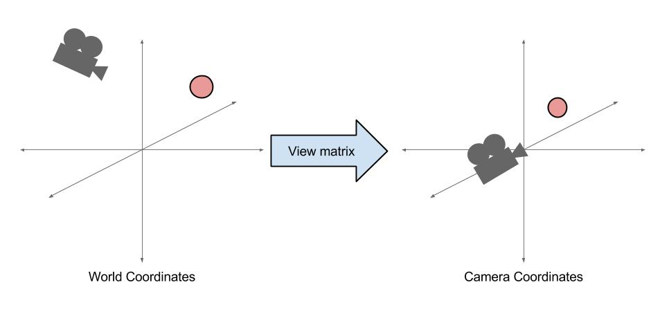
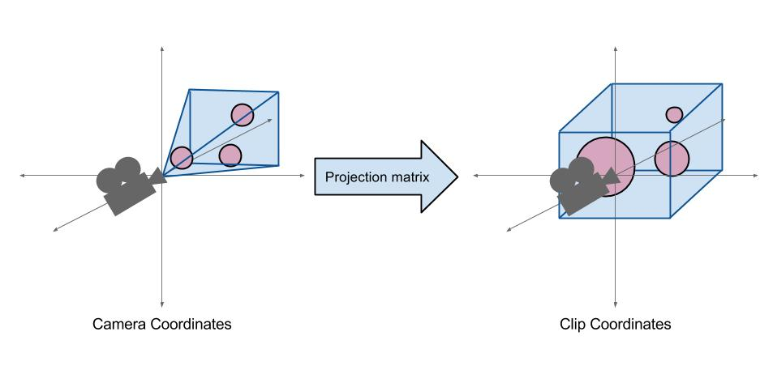
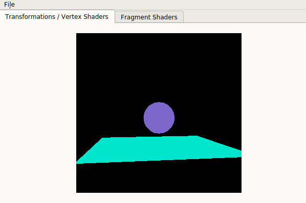
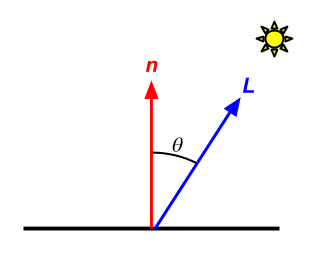
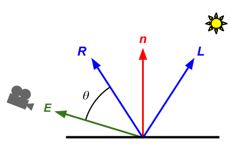

# Lab 6 - 3D OpenGL (Transformations, Vertex Shaders & Phong Lighting)

## Prologue

Last week you learned how to draw 2D shapes in OpenGL using VBOs and VAOs, as well as use fragment shaders. In this lab, we will use OpenGL to draw a 3D scene with moving shapes and implement a phong shader!

Specifically, we will use the three basic types of **transformations**: translation, scaling, and rotation.  We will also use **vertex shaders** to process each vertex individually before rendering. Fragment shaders, on the other hand, output a color for every pixel, aka “fragment.”

## Getting Started

Navigate into `~/course/cs1230/labs` (or wherever you cloned the lab repository) and run the command 
```
git pull origin master
```
To get the most up to date version of lab06

Otherwise if you need to reclone the directory from scratch you can get the labs starter code by opening up a terminal and running:
```
git clone https://github.com/cs123tas/labs.git
```

## Support Code

Take a look at GLVertWidget::initializeGLTransformationsVertexShaders(). This method is called in GLVertWidget::initializeGL(). Here we have initialized m\_sphere and m\_square. These are both unique\_ptrs to OpenGLShape, the class you implemented in Lab 5. We have included our implementation of OpenGLShape in this lab’s support code. Take a look for a refresher!

The sphere has a radius of 0.5 and is centered at the origin. The only thing left to do is draw it.

### Task 1:

*   In GLVertWidget::paintGLTransformationsVertexShaders() (which is called in GLVertWidget::paintGL()), draw m\_sphere after the call to glUniform3f
*   Run your program. You should see a sphere!

## The Vertex Shader

Let’s say instead of having the sphere in the center of the screen, we want to move it up along the y-axis.

One way we could do this would be to redefine all our vertex positions with new x-values and send them to the GPU using OpenGLShape::setVertexData(...). Unfortunately, it is cumbersome and costly to recompute all the vertex positions for a sphere. Also, shuttling data from the CPU to the GPU is expensive. In many programs objects are moving constantly, so we really want to avoid calling setVertexData(...) on every frame. There has got to be a better way to do it...

Vertex shaders to the rescue! **Vertex shaders** are programs that process each vertex individually before rendering. Here’s the OpenGL pipeline diagram again to give an idea of where it fits in the big picture.


Shaders run directly on the GPU, so they are a blazing fast way to do computations for each vertex. Their main job is to output the vertex’s final position.

Open the file Other Files/shaders/shader.vert. Let’s take a closer look:

*   #version 330

  *   All shaders begin with a line like this that identifies the GLSL version being used.

*   layout(location = 0) in vec3 position;

  *   This declares a vertex attribute (called an “in variable”) with type vec3 that is called position.
  *   On each execution of the vertex shader, position gets one of the positions that we stored in the VBO (Vertex Buffer Object).
  *   layout(location = 0) is an optional part of the declaration that allows us to set the location (or index) of this attribute.
  *   Remember in Lab 1 we used ShaderAttrib::POSITION as the "index" when calling OpenGLShape::setAttribute()? It was actually equal to 0, because the position attribute's location was set to 0 in the vertex shader.

*   void main() { ... }

  *   All vertex shaders must contain a main function, which is automatically called for each vertex.

*   gl\_Position = vec4(position, 1.0);

  *   The main function is required to set the value of gl\_Position, a built-in variable that determines the position of the vertex. Here we are simply setting it to the value of position. We need to convert position to  a vec4 though, setting the w-component to 1.0.

Okay, so we have a sphere centered at the origin, but we want all of its vertex positions to be translated in the y direction. Let's use the vertex shader to do this!

### Task 2:

*   In the shader.vert, add 0.5 to gl\_Position.y.
*   Run the program. The sphere should be moved up on the screen!

Instead of hardcoding the transformation like this in the shader, we would like the shader to work for arbitrary transformations. To do this, we’d like to send a transformation matrix from the C++ code to the vertex shader. Uniforms work exactly the same in fragment and vertex shaders, so this will work the same as the fragment shaders we saw earlier (feel free to look back at the lab 5 handout for a refresher).

We already defined a uniform in the vertex shader called “model.” The **model matrix** is a matrix that transforms an object (discussed more in the next section).

Note: glUniform is a family of functions that have different names depending on what you’re passing. glUniform3fv passes a vec3, whereas glUniformMatrix3fv passes a mat3.

### Task 3:

*   In GLVertWidget::paintGLTransformationsVertexShaders() make a translation matrix (glm::mat4) using glm::translate, which takes in a glm::vec3.

*   The 3 entries in the glm::vec3 represent the x, y, and z translation. For now, you can mimic what we did in the vertex shader and move the sphere in the y direction by 0.5, so make the second argument of the glm::vec3 0.5

*   Get the location of the model uniform by calling glGetUniformLocation(m\_program, “model”).
*   Then use glUniformMatrix4fv and pass in

  *   the uniform location, 1, GL\_FALSE, glm::value\_ptr(your translation matrix)

*   Then in shader.vert, instead of adding 0.5 to gl\_Position.x, transform gl\_Position using the model matrix uniform.
*   Run your program. The sphere should be moved according to the translation matrix!

You may have noticed that the support code sets another uniform called “color” in paintGLTransformationsVertexShaders() . This is used by the **fragment shader** (which we covered last time) to assign the object’s color. Feel free to change that value to change the sphere’s color!

## Model, View, and Projection Matrices

We used a model matrix to transform an object from **object coordinates** (where the origin is at the center of the object) to **world coordinates** (where the origin is at another set location).



In a typical 3D scene, there are two additional matrices we use to produce the final vertex positions.

To start, the camera might be located at some arbitrary location in world coordinates. The **view matrix** takes all objects from world coordinates to **camera coordinates**, where the camera is at the origin and pointed along the negative z-axis.

eye,

You could make your own view matrix by combining a translation and a rotation matrix, but GLM has a handy-dandy function to do this for you.

*   glm::lookAt(eye, center, up) takes in the camera’s position, the center point where the camera is looking, and the camera’s “up” direction (usually (0,1,0)); and it returns the corresponding view matrix.

  *   The eye vector is the camera’s position.
  *   The center vector is where the camera is looking.
  *   The up vector is the up direction.

The final matrix we care about is the **projection matrix.** This is a more complicated matrix that takes care of making a perspective projection, which transforms from eye coordinates to **clip coordinates,** where closer objects appear bigger.



*   To obtain a projection matrix you can call glm::perspective(fieldOfViewY, aspectRatio, nearClipPlane, farClipPlane).

  *   The fieldOfView is the vertical field of the view angle in radians.
  *   The aspectRatio is the aspect ratio of the window.
  *   The nearClipPlane is the z value where the near clipping plane is.
  *   The farClipPlane is the z value where the far clipping plane is.

In order to render a scene with a perspective projection, we need gl\_Position to be in clip coordinates. Since the sphere’s vertex positions are defined in object coordinates, we need to multiply each vertex position by *all three* of these matrices.

### Task 4:

*   In the vertex shader, use the uniforms for the view and projection (perspective) matrices. Multiply gl\_Position by *all three* matrices.

  *   \*\*\*Pay attention to the multiplication order!\*\*\*
  *   Matrices are multiplied right-to-left, so the matrix on the left will be applied last.

*   Now, in paintGLTransformationsVertexShaders() , use the variables we defined for you to create the view and projection matrices.  Copy how you made the view matrix.

  *   Use glm::lookAt to generate the view matrix.  Re-read the description in the section above for help using glm::lookAt().
  *   Use glm::perspective to generate the projection matrix. Re-read the description in the section above for help using glm::perspective().

*   Send the matrices to the respective uniform variables. To see how, look at what you did to pass the model matrix to the “model” uniform.
*   Your program should now show a smaller sphere, because the camera is farther away at (0, 1, 6).

## Drawing Multiple Shapes

Now let’s draw m\_square! We’ll assign it a different color so we can tell the difference between the sphere and the square.

### Task 5:

*   In paintGLTransformationsVertexShaders()  after drawing m\_sphere, set the “color” uniform to a different RGB color.

  *   We do this using the following function
  *   glUniform3f(glGetUniformLocation(m\_program, "color"), red, green, blue);
  *   The color components should be in the range \[0, 1\].

*   Then draw m\_square.
  *   You should now see a colored square. But where’s the sphere? Based on the vertices’ initial positions, we would expect to see the sphere in front of the square...

By default, OpenGL will draw each shape on top of what it already drew. But we only want to draw on top if we’re drawing a triangle that’s closer to the camera! Fortunately, it’s easy to make OpenGL do a “depth test” so farther triangles aren’t drawn on top of closer ones.

### Task 6:

*   In initializeGLTransformationsVertexShaders() , call glEnable(GL\_DEPTH\_TEST).
*   You should now see half of a sphere poking out front of your square.

*   **If you still don’t see the sphere,** make sure you set the “color” uniform to a new color between m\_sphere->draw() and m\_square->draw().

Now let’s use our knowledge of uniforms and transformations to make the scene more interesting!

### Task 7:

Make your scene act like the demo as shown below! Here’s what the demo does:

*   The square is scaled by 2 (glm::scale) and rotated to lie on the XZ plane (glm::rotate). For rotation note that we have told GLM that angles are in radians.

  *   We want to pass in the scale and rotation transformations into the “model” uniform by multiplying the two matrices.

*   The ball is translated to look like it’s bouncing.

  *   For this, you can use the equation: y = 0.5 + fabs( sin(3 \* time) );

*   Camera position (eye) goes in a circle of radius 6 where y always equals 1.

  *   We’ve made a member variable m\_angle that is incremented by 1 degree 60 times every second
  *   The x and z values of the eye should be adjusted according to the equations below:

    *   x \= 6 \* cos(m\_angle)
    *   y \= 6 \* sin(m\_angle)




## Part 2: Phong Lighting

We will be writing a shader program that shows lighting on a sphere. We’ve set up 3 spheres for you on the Phong tab of the lab (you can probably guess what we used to position them based on what you did in the last part). The code for this is in GLWidget::paintGL if you would like to take a look.

If you’d like to see a demo of this part of the lab, try running cs1230\_lab03\_demo on a department machine (this lab was formerly lab 3).

Now onto the lighting. We will be implementing the commonly used **Phong lighting model** (which you've seen before in intersect!). This computes lighting in the fragment shader by splitting it into three parts: ambient, diffuse, and specular.

## The Ambient Component

We’ll start by adding in the **ambient** component. The ambient component simply adds a constant amount of lighting to all objects in the scene. Without it many scenes appear too dark. To see this in effect, try running the demo for this lab and setting Ambient to 0.

The amount of ambient light will be given by the object color (color) times the amount of ambient light (ambientIntensity).

### Task 8:

In phong.frag, set the output color (fragColor) to the ambient component of the Phong lighting model. Your spheres should now be solid colors that vary in brightness with the “Ambient” slider.

## The Diffuse Component


Now let’s add the **diffuse** component, which makes surfaces that are facing towards the light source appear brighter. We will represent how much a surface is facing the light source with the expression n • L, where n is the normal vector and L is the normalized vector from the surface point to the light source.



To see why this works, recall that for two normalized vectors n and L,

n • L = cos(𝜃).

When the surface is facing exactly towards the light, n • L = cos(0°) = 1. When n is perpendicular to L, n • L = cos(90°) = 0. When n is facing in the opposite direction as L, the dot product is negative.

Take a look at the vertex shader. At the top you will find vertex attributes for the position and normal. We have named them ObjectSpace\_position and ObjectSpace\_normal.  We recommend using this naming convention so you can keep track of what space your points and vectors are in (You probably won’t need to use all of these):

*   ObjectSpace\_position
*   WorldSpace\_position
*   CameraSpace\_position
*   ClipSpace\_position

When doing lighting computations, you’ll want to do all computations in either world space or camera space. It doesn’t matter which[\[1\]](#ftnt1), **but it is important that you pick one**. The dot product between vectors in different spaces is meaningless.

### Task 9:

Add the diffuse component to the output color by following these steps:

In the vertex shader, we've transformed the position and normal to camera-space and sent those to the fragment shader using out variables.
1. If you'd like to work in world space, you can change this to transformed the position and normal to world space instead

Tip: Look back at how we transformed between spaces in lab 2 using the model, view, and projection matrices! You can transform vectors the same way as points, as long as there is no scaling in your    scene[\[2\]](#ftnt2). We’re not scaling anything in this lab, so you can use the same transformations for vectors and points alike, making sure the w-component is 0 for vectors and 1 for points.

2.  In the fragment shader, use the normal, vertex position, and light position (WorldSpace\_lightPos) to compute n • L. Some notes:

  *  n is the normal vector
  *  L is the normalized vector from the surface point to the light source
  *  Use the built-in GLSL function dot.
  *  Make sure that n and L are both normalized in the fragment shader (use the build-in GLSL function normalize).
  * Ignore negative dot products using one of the built-in GLSL functions max or clamp.

3.  Add the diffuse lighting component to the output color. Ignore the light intensity for now.

color \* lightColor \* diffuseIntensity \* (n • L).

Your spheres should now look more or less like this:


## Specular Component


Finally we have the **specular** component, which adds a highlight that makes objects appear shiny. The specular component peaks in brightness when light is reflected in the direction of the eye. We will now use the dot product R • E.



In order to make the specular highlight small, we raise the dot product to an exponent called *shininess*. The higher the exponent, the smaller the highlight.

### Task 10:

Add the specular component. Once again, ignore the light intensity for now:

color \* lightColor \* specularIntensity \* (E • R)^shininess.

Tips for computing the specular highlight:

*   E is the normalized vector to the eye.
*   R is the reflection of L about the normal.
*   To compute the vector E, recall that the eye is at the origin in camera space.
*   To compute the vector R, use the built-in GLSL function [reflect](https://www.google.com/url?q=https://www.khronos.org/registry/OpenGL-Refpages/gl4/html/reflect.xhtml&sa=D&source=editors&ust=1634307905079000&usg=AOvVaw3VMbF2Z08zLC7jbTqcS29j). Note that the incident vector[\[3\]](#ftnt3) for the reflect function should point in the opposite direction as L in the above diagram.
*   Don’t forget to use max or clamp to ignore negative dot products.

Your spheres should now look roughly like this (depending on the UI parameters):


## Light Attenuation

The last thing we will add to our Phong model is **light attenuation**, which makes objects dimmer as they get farther away from the light. The attenuation of a light is usually modelled with a function that decreases quadratically with distance.

### Task 11:

Multiply the diffuse and specular components by

lightIntensity \* min(1 / (attConstant + attLinear \* d + attQuadratic \* d^2), 1)

where d is the distance from the surface point to the light.

Your three spheres should now vary in brightness depending on how close they are to the light.


End
===

Once you have everything working, play around with the controls to see how they affect the image!

Be prepared to answer one or more of the following:

*   Describe the three transformation matrices in this lab.
*   In code, what order would you write the multiplication for a vec3 and the perspective(projection), view, and model matrices?
*   What is the difference between vertex shaders and fragment shaders?
*   What are the three components of the Phong lighting model? How do they each work?
*   How does attenuation affect lighting in this model?

* * *

[\[1\]](#ftnt_ref1) The dot product is preserved because the view matrix, which converts between world and camera space, is orthogonal. We know this from the construction of the view matrix; u, v, and w are orthonormal.

[\[2\]](#ftnt_ref2) When scaling is involved, vectors are transformed using the inverse-transpose of the upper 3x3 of the transformation matrix.

[\[3\]](#ftnt_ref3) A vector representing the incoming direction of light to the surface, hence the need for reversing L.
